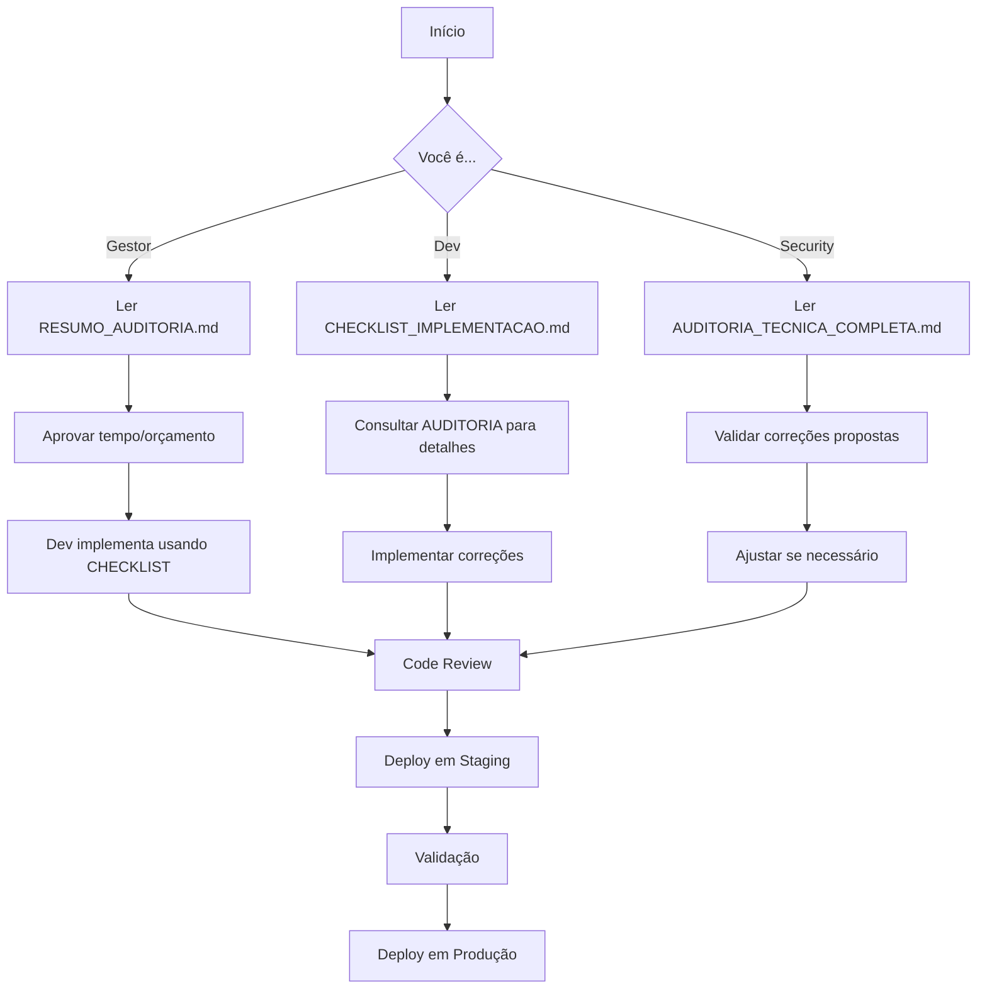

# 📚 Índice - Auditoria Técnica do Projeto SIS RUA

**Data da Auditoria**: 19 de Fevereiro de 2026  
**Status**: ⚠️ **APROVADO COM RESSALVAS** - Pontuação: **6.9/10**

---

## 📖 Documentos da Auditoria

Este índice organiza todos os documentos criados durante a auditoria técnica completa do projeto SIS RUA Unified.

### Para Começar: Qual documento ler?

```
┌─────────────────────────────────────────────────────┐
│  Você é...              │  Leia primeiro...         │
├─────────────────────────────────────────────────────┤
│  👨‍💼 Gestor/Product Owner │  RESUMO_AUDITORIA.md      │
│  👨‍💻 Desenvolvedor         │  CHECKLIST_IMPLEMENTACAO  │
│  🔐 Security Engineer    │  AUDITORIA_TECNICA_COMP.  │
│  🎯 Tech Lead            │  Todos os documentos      │
└─────────────────────────────────────────────────────┘
```

---

## 1️⃣ RESUMO_AUDITORIA.md (6.6KB) 📊

**Público**: Gestores, Product Owners, Stakeholders  
**Tempo de leitura**: 10 minutos  
**Formato**: Resumo executivo

### O que contém:
- ✅ Pontuação global (6.9/10) com gráficos visuais
- ✅ Top 14 issues prioritizados (3 críticos, 5 altos, 6 médios)
- ✅ Plano de ação em 3 fases com prazos
- ✅ Estimativa de custos GCP
- ✅ Roadmap visual (Gantt)
- ✅ Comparação com benchmarks da indústria
- ✅ Ações imediatas recomendadas

### Quando ler:
- ⏰ **AGORA** - Para entender o status geral do projeto
- 📅 Antes de reuniões de planejamento
- 💰 Antes de aprovação de orçamento para correções

### Links diretos:
- [Ver arquivo completo](./RESUMO_AUDITORIA.md)

---

## 2️⃣ AUDITORIA_TECNICA_COMPLETA.md (36KB) 🔍

**Público**: Desenvolvedores, Security Engineers, Arquitetos  
**Tempo de leitura**: 45-60 minutos  
**Formato**: Relatório técnico detalhado

### O que contém:
- ✅ Análise de segurança linha por linha (backend, frontend, Python)
- ✅ Auditoria completa de dependências (NPM + Python)
- ✅ Revisão de arquitetura e infraestrutura GCP
- ✅ Análise de workflows GitHub Actions
- ✅ Código de exemplo para TODAS as correções
- ✅ Explicação técnica de cada vulnerabilidade
- ✅ Testes sugeridos para validação

### Estrutura:
1. **Sumário Executivo** (p. 1-3)
2. **Análise de Segurança** (p. 4-20)
   - Backend (Node.js/Express)
   - Frontend (React/TypeScript)
   - Python Engine
3. **Análise de Dependências** (p. 21-25)
4. **Análise de Arquitetura** (p. 26-32)
5. **Análise de Testes** (p. 33-36)
6. **Documentação** (p. 37-40)
7. **Workflows CI/CD** (p. 41-45)
8. **Plano de Ação** (p. 46-50)
9. **Métricas e Benchmarks** (p. 51-53)
10. **Conclusão** (p. 54-60)

### Quando ler:
- 🔍 Para entender COMO corrigir cada issue
- 📚 Antes de implementar correções
- 🎓 Para aprender sobre segurança em aplicações Node.js/React
- 🔐 Durante code reviews de segurança

### Destaques:
- 💡 **Issue #1 (Crítico)**: Implementação completa de OIDC validation
- 💡 **Issue #4 (Alto)**: Sistema de autenticação por API Key
- 💡 **Issue #6 (Alto)**: Schemas Zod para todos os endpoints

### Links diretos:
- [Ver arquivo completo](./AUDITORIA_TECNICA_COMPLETA.md)
- [Ir para Issue #1 (OIDC)](./AUDITORIA_TECNICA_COMPLETA.md#-crítico-1-webhook-cloud-tasks-sem-autenticação)
- [Ir para Plano de Ação](./AUDITORIA_TECNICA_COMPLETA.md#-7-plano-de-ação-priorizado)

---

## 3️⃣ CHECKLIST_IMPLEMENTACAO.md (17KB) ✅

**Público**: Desenvolvedores implementando as correções  
**Tempo de leitura**: 30 minutos (referência contínua)  
**Formato**: Guia passo-a-passo com comandos

### O que contém:
- ✅ Checklist interativo para cada correção
- ✅ Comandos shell prontos para copiar/colar
- ✅ Código TypeScript/JavaScript completo
- ✅ Testes de validação para cada passo
- ✅ Tracking de progresso por fase
- ✅ Estimativas de tempo realistas

### Estrutura por Fase:

#### 🔴 FASE 1: CRÍTICO (1-2 dias)
1. **Issue #1**: Implementar OIDC no webhook (2h)
   - 6 passos detalhados
   - Código completo do middleware
   - Testes de validação
2. **Issue #2**: Atualizar dependências (2h)
   - 7 passos com rollback
   - Scripts de teste
3. **Issue #3**: Remover API key exposure (30min)
   - Localização exata do código
   - Diff do antes/depois

#### 🟠 FASE 2: ALTO (1 semana)
4. **Issue #4**: API Key authentication (1 dia)
5. **Issue #5**: Rate limiting webhook (1h)
6. **Issue #6**: Validação Zod completa (3h)
7. **Issue #7**: Migrar para Firestore (4h)
8. **Issue #8**: Limitar body size (1h)

#### 🟡 FASE 3: MÉDIO (2-4 semanas)
9-14. Otimizações e hardening

### Como usar:
```bash
# 1. Abra o checklist
code CHECKLIST_IMPLEMENTACAO.md

# 2. Para cada issue, siga os passos marcando com [x]:
- [ ] Passo 1: ...  →  - [x] Passo 1: ...

# 3. Copie os comandos e execute
# 4. Valide com os testes fornecidos
# 5. Commite seguindo as mensagens sugeridas
```

### Quando usar:
- 🚀 **Durante a implementação** de cada correção
- 📋 Para tracking de progresso
- 🔄 Em code reviews para validar que todos os passos foram seguidos
- 📚 Como referência de boas práticas

### Links diretos:
- [Ver arquivo completo](./CHECKLIST_IMPLEMENTACAO.md)
- [Fase 1: Crítico](./CHECKLIST_IMPLEMENTACAO.md#-fase-1-crítico-prazo-1-2-dias)
- [Fase 2: Alto](./CHECKLIST_IMPLEMENTACAO.md#-fase-2-alto-prazo-1-semana)
- [Tracking de Progresso](./CHECKLIST_IMPLEMENTACAO.md#-tracking-de-progresso)

---

## 📊 Visão Geral dos Issues

### Distribuição por Severidade

```
🔴 CRÍTICO (3 issues)     ████████████░░░░░░░░ 21%
🟠 ALTO (5 issues)        ███████████████████░ 36%
🟡 MÉDIO (6 issues)       ██████████████████░░ 43%
```

### Esforço Total Estimado

```
Fase 1 (Crítico):    4.5 horas   ██░░░░░░░░░░░░░░░░░░
Fase 2 (Alto):       2 dias      ████████░░░░░░░░░░░░
Fase 3 (Médio):      2-4 semanas ████████████████████
```

---

## 🎯 Guia Rápido de Decisão

### Preciso fazer deploy HOJE?

```
❌ NÃO - Se o deploy é público
   → Risco: Endpoints sem autenticação

✅ SIM - Se for apenas staging/interno
   → Mas monitore de perto
   → Implemente correções críticas em 2 dias
```

### Quanto tempo preciso para deixar seguro?

```
Mínimo aceitável:  2 dias    (Fase 1 - Crítico)
Recomendado:       1 semana  (Fase 1 + Fase 2)
Ideal:             1 mês     (Todas as fases)
```

### Quanto vai custar implementar?

```
💰 Custo de desenvolvimento:
   - Fase 1: 4.5h × $X/hora
   - Fase 2: 2 dias × $X/dia
   - Fase 3: 2-4 semanas × $X/semana

💰 Custo de infraestrutura (GCP):
   - Adicional: +$15-25/mês
   - Total: $45-95/mês
```

---

## 📝 Como Usar Este Índice

### Fluxo Recomendado:



---

## 🔗 Links Relacionados

### Documentação do Projeto
- [README Principal](./README_COMPLETO.md)
- [Security Checklist](./sisrua_unified/SECURITY_CHECKLIST.md)
- [Arquitetura](./sisrua_unified/ARCHITECTURE.md)
- [Docker Guide](./sisrua_unified/DOCKER_USAGE.md)

### Documentação de Referência Externa
- [OWASP Top 10](https://owasp.org/www-project-top-ten/)
- [Node.js Security Best Practices](https://nodejs.org/en/docs/guides/security/)
- [React Security](https://react.dev/learn/security)
- [GCP Security](https://cloud.google.com/security/best-practices)

---

## ✅ Checklist de Leitura

Use este checklist para garantir que leu toda a documentação necessária:

### Para Gestores/Product Owners:
- [ ] Leu RESUMO_AUDITORIA.md
- [ ] Entendeu os 3 issues críticos
- [ ] Aprovou tempo para Fase 1 (2 dias)
- [ ] Aprovou orçamento adicional GCP (+$15-25/mês)
- [ ] Decidiu sobre deploy (staging vs produção)

### Para Desenvolvedores:
- [ ] Leu RESUMO_AUDITORIA.md (contexto)
- [ ] Leu AUDITORIA_TECNICA_COMPLETA.md (detalhes técnicos)
- [ ] Abriu CHECKLIST_IMPLEMENTACAO.md (referência)
- [ ] Configurou ambiente de desenvolvimento
- [ ] Criou branch para correções

### Para Security Engineers:
- [ ] Leu AUDITORIA_TECNICA_COMPLETA.md completamente
- [ ] Validou todas as 14 vulnerabilidades
- [ ] Revisou código de exemplo das correções
- [ ] Preparou testes de validação
- [ ] Configurou ferramentas de scanning (Snyk, Trivy)

### Para DevOps:
- [ ] Leu seção de infraestrutura (AUDITORIA, seção 3)
- [ ] Configurou secrets no GCP Secret Manager
- [ ] Preparou ambiente de staging
- [ ] Configurou alertas de segurança
- [ ] Revisou workflows de CI/CD

---

## 📞 Suporte

**Dúvidas sobre a auditoria?**

1. Consulte primeiro: AUDITORIA_TECNICA_COMPLETA.md (seção específica)
2. Consulte depois: CHECKLIST_IMPLEMENTACAO.md (passos práticos)
3. Ainda com dúvidas: Abra uma issue no GitHub

**Encontrou um erro na auditoria?**

Por favor, reporte com:
- Nome do arquivo
- Número da linha
- Descrição do erro/melhoria
- Impacto (se aplicável)

---

## 📅 Próxima Revisão

**Data**: 19 de Março de 2026 (30 dias)

**O que será revisado**:
- Progresso nas correções implementadas
- Novas vulnerabilidades descobertas
- Atualizações de dependências
- Mudanças na infraestrutura

---

## 🎓 Conclusão

Esta auditoria identificou **14 issues de segurança**, sendo:
- 🔴 3 **críticos** (exigem ação imediata)
- 🟠 5 **altos** (implementar em 1 semana)
- 🟡 6 **médios** (implementar em 1 mês)

**Pontuação atual**: 6.9/10 ⚠️  
**Pontuação após Fase 1**: 7.5/10 🟡  
**Pontuação após Fase 2**: 8.5/10 ✅  
**Pontuação após Fase 3**: 9.0/10 🎯

O projeto está **APROVADO COM RESSALVAS** para deploy em ambiente controlado/staging, mas **REQUER CORREÇÕES CRÍTICAS** antes de deploy público em produção.

---

**Boa implementação! 🚀**

_"A segurança é uma jornada, não um destino."_

---

**Última atualização**: 19/02/2026  
**Versão do índice**: 1.0  
**Autor**: GitHub Copilot Technical Audit Agent
