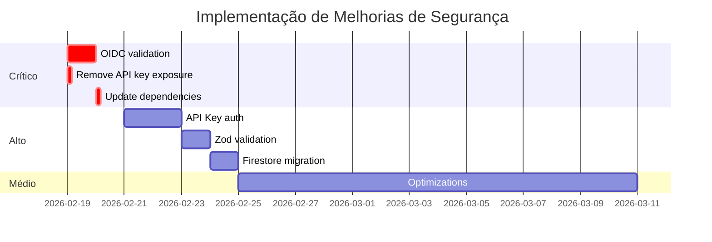

# 📊 Resumo Executivo - Auditoria Técnica SIS RUA

**Data**: 19/02/2026 | **Versão**: 1.0.0 | **Status**: ⚠️ **APROVADO COM RESSALVAS**

---

## 🎯 Pontuação Global: **6.9/10**

```
Segurança do Código:    ████████░░ 6.5/10  ⚠️
Dependências:           █████░░░░░ 5.0/10  🔴
Infraestrutura:         ███████░░░ 7.0/10  🟡
Arquitetura:            ████████░░ 7.5/10  ✅
Documentação:           █████████░ 8.5/10  ✅
Testes:                 ███████░░░ 7.0/10  🟡
```

---

## 🚨 Issues Prioritizados

### 🔴 CRÍTICO - Corrigir IMEDIATAMENTE (1-2 dias)

| # | Issue | Arquivo | Esforço | Risco |
|---|-------|---------|---------|-------|
| 1 | **Webhook sem autenticação OIDC** | `server/index.ts:252` | 2h | DoS, abuse de recursos |
| 2 | **37 vulnerabilidades NPM** | `package.json` | 2h | Exploits conhecidos |
| 3 | **API key exposta em /health** | `server/index.ts:232` | 30min | Fingerprinting |

### 🟠 ALTO - Corrigir em 1 semana

| # | Issue | Impacto |
|---|-------|---------|
| 4 | Sem autenticação em endpoints | Abuse ilimitado da API |
| 5 | Rate limit ausente no webhook | Sobrecarga do servidor |
| 6 | Validação insuficiente de inputs | Injeção de dados maliciosos |
| 7 | Jobs só em memória | Perda de dados em restart |
| 8 | Body size 50MB sem validação | Upload de payloads gigantes |

### 🟡 MÉDIO - Corrigir em 2-4 semanas

| # | Issue | Tipo |
|---|-------|------|
| 9 | Parsing XML sem validação | XXE vulnerability |
| 10 | Polling sem backoff | Performance |
| 11 | Memory leak em BatchUpload | Estabilidade |
| 12 | Logs expõem infra GCP | Information disclosure |
| 13 | Cache não persistente | Perda de otimizações |
| 14 | Sem CSP headers | XSS vulnerability |

---

## ✅ Pontos Fortes do Projeto

1. ✅ **Documentação Excelente** - SECURITY_CHECKLIST.md muito completo
2. ✅ **CI/CD Robusto** - Pre-deploy, post-deploy, health checks
3. ✅ **Arquitetura Moderna** - Cloud Run, Cloud Tasks, serverless
4. ✅ **Deps Produção Seguras** - Express, Multer, GROQ atualizados
5. ✅ **Código Limpo** - TypeScript, Zod validation, structured logging

---

## 📋 Plano de Ação Recomendado

### Fase 1: Correções Urgentes (2 dias)

```bash
# 1. Implementar validação OIDC
npm install google-auth-library
# Código em: AUDITORIA_TECNICA_COMPLETA.md, seção 1.1

# 2. Remover exposição de API key
# Editar server/index.ts:232, remover campo 'prefix'

# 3. Atualizar dependências
npm audit fix
npm install eslint@latest jest@latest @vitest/coverage-v8@latest --save-dev

# 4. Adicionar rate limit ao webhook
# Código em: AUDITORIA_TECNICA_COMPLETA.md, seção 1.1
```

**Resultado Esperado**: Score sobe para **7.5/10** ✅

---

### Fase 2: Melhorias de Segurança (1 semana)

```bash
# 5. Implementar autenticação API Key (1 dia)
# 6. Adicionar validação Zod completa (3h)
# 7. Migrar job status para Firestore (4h)
# 8. Implementar CSP headers (1h)
# 9. Adicionar security scan workflow (2h)
```

**Resultado Esperado**: Score sobe para **8.5/10** ✅

---

### Fase 3: Otimizações (2-4 semanas)

- Exponential backoff no polling
- Cache persistente (Cloud Storage)
- Validação de polígono no Python
- Sanitização de KML
- Testes de segurança E2E

**Resultado Esperado**: Score sobe para **9.0/10** 🎯

---

## 💰 Impacto nos Custos (GCP)

**Atual**: $20-70/mês ✅ Muito econômico

**Após melhorias**:
- Firestore: +$10/mês
- Secret Manager: +$0 (grátis até 6 secrets)
- Cloud Armor: +$15/mês (proteção DDoS)
- **Total**: $45-95/mês ✅ Ainda muito econômico

---

## 📈 Roadmap de Segurança



---

## 🎓 Lições Aprendidas

### O que está funcionando bem:
1. 🎯 **Processo de deploy** - Automatizado e confiável
2. 📚 **Documentação** - Completa e em português
3. 🏗️ **Arquitetura** - Escalável e moderna
4. 🧪 **Testes** - Boa cobertura (backend + frontend + E2E)

### O que precisa melhorar:
1. 🔐 **Autenticação** - Implementar antes de abrir publicamente
2. 📊 **Monitoramento** - Adicionar observabilidade
3. 💾 **Persistência** - Migrar estado para Firestore
4. 🛡️ **Validação** - Schemas Zod em todos endpoints

---

## 🔍 Comparação com Benchmarks da Indústria

| Aspecto | SIS RUA | Média Indústria | Status |
|---------|---------|------------------|--------|
| Autenticação | ❌ Ausente | ✅ Presente | 🔴 Abaixo |
| Rate Limiting | 🟡 Parcial | ✅ Completo | 🟡 Adequado |
| Validação Input | 🟡 Parcial | ✅ Completo | 🟡 Adequado |
| Auditoria | ❌ Ausente | ✅ Presente | 🔴 Abaixo |
| Documentação | ✅ Excelente | 🟡 Básica | ✅ Acima |
| CI/CD | ✅ Robusto | ✅ Presente | ✅ Igual |
| Testes | ✅ Bom | ✅ Presente | ✅ Igual |

---

## 📞 Ações Imediatas Recomendadas

### Para Desenvolvedores:
1. ✅ Ler AUDITORIA_TECNICA_COMPLETA.md (seções 1.1, 1.2, 7.1)
2. ✅ Implementar correções críticas (issues #1-3)
3. ✅ Executar `npm audit fix`
4. ✅ Testar em staging antes de deploy

### Para DevOps:
1. ✅ Configurar secrets no GCP Secret Manager
2. ✅ Implementar Cloud Armor
3. ✅ Configurar alertas de segurança
4. ✅ Revisar logs de acesso

### Para Gestão:
1. ✅ Aprovar tempo para implementação (estimativa: 2 semanas)
2. ✅ Decidir sobre deploy (staging vs produção)
3. ✅ Planejar treinamento de segurança da equipe
4. ✅ Revisar orçamento para ferramentas de segurança

---

## ✍️ Assinatura

**Auditoria realizada por**: GitHub Copilot Technical Audit Agent  
**Data**: 19 de Fevereiro de 2026  
**Versão do Relatório**: 1.0  
**Próxima Revisão**: 19 de Março de 2026 (30 dias)

**Documentos de Referência**:
- 📄 Relatório Completo: `AUDITORIA_TECNICA_COMPLETA.md`
- 🔒 Security Checklist: `sisrua_unified/SECURITY_CHECKLIST.md`
- 🏗️ Arquitetura: `sisrua_unified/ARCHITECTURE.md`

---

**Status Final**: ⚠️ **APROVADO COM RESSALVAS** - Implementar correções críticas antes de deploy público

---

_"Segurança é um processo contínuo, não um destino final."_
