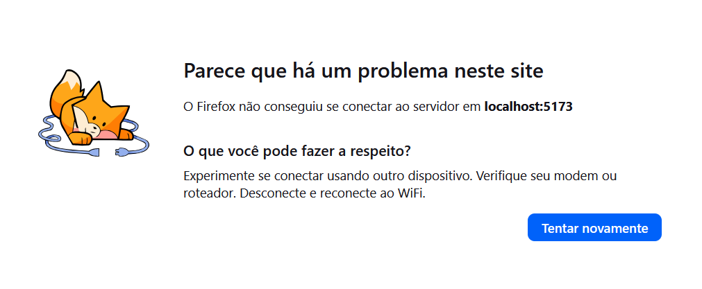
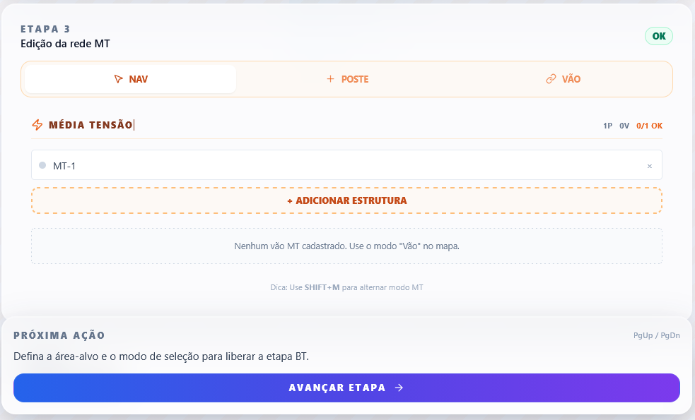
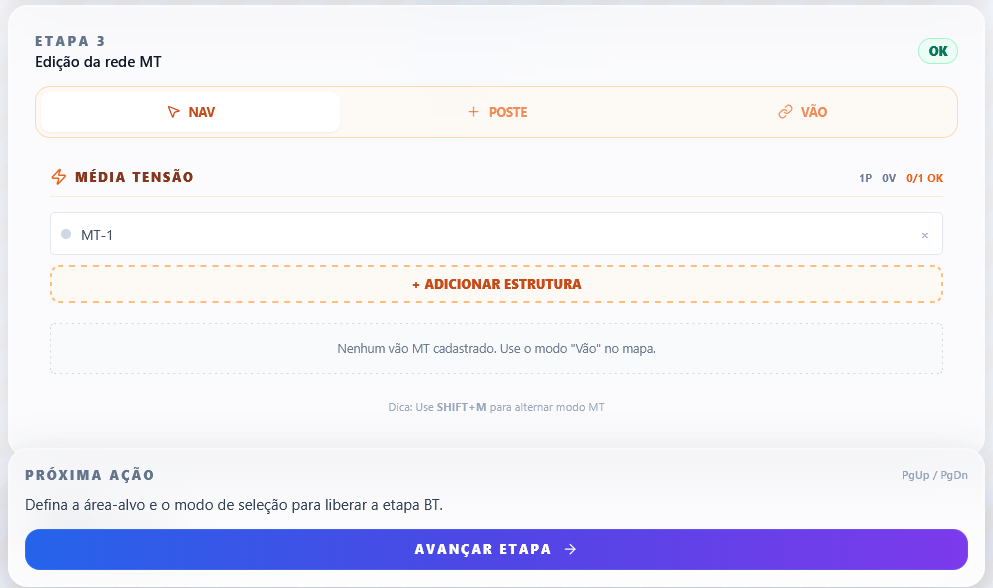
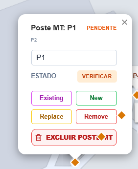
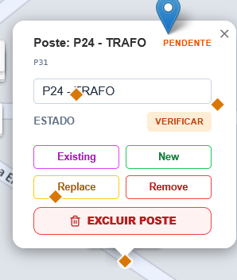

# 🗺️ Roadmap Estratégico & Diretrizes de Desenvolvimento 2026

Este documento estabelece a visão técnica, os pontos de melhoria prioritários e as regras fundamentais (Non-negotiables) para a evolução do **sisTOPOGRAFIA (sisRUA Unified)**.

## 🛡️ Regras Não Negociáveis (Non-negotiables)

> [!IMPORTANT]
> Estas regras são obrigatórias e devem ser seguidas sem exceção em cada interação de desenvolvimento.

- **Fluxo de Git**: Apenas na branch `dev`.
- **Memória de Contexto**: OBRIGATÓRIO Criar/Ler o `RAG/MEMORY.md` para entender o contexto do projeto antes de qualquer ação.
- **Integridade de Dados**: **NÃO usar dados mockados**. Trabalhar exclusivamente com dados reais ou gerados via lógica de geoprocessamento.
- **Dimensionalidade**: Não usar 3D e sim **2.5D** em todo o projeto.
- **Arquitetura & Design**:
  - **Modularidade**: Responsabilidade Única (Separação de Responsabilidades).
  - **Clean Code**: Otimização do código — _"mais resultado em menos linhas"_.
  - **Thin Frontend / Smart Backend**: Lógica pesada no servidor.
  - **DDD**: Arquitetura orientada a Domain-Driven Design.
- **Segurança & Dados**:
  - **Sanitização**: Sanitizar todos os dados de entrada.
  - **Segurança First**: Implementar proteções em todas as camadas.
- **BIM & Engenharia**:
  - **Half-way BIM**: Manter e evoluir a estrutura de metadados BIM.
- **DevOps**:
  - **Docker First**: Manter e utilizar `Dockerfile`, `docker-compose.yml`, `.dockerignore` e `.gitignore` sempre atualizados.
- **Supabase First**: Usar Supabase sempre que possível (auth, banco, storage, edge functions, realtime).
- **Versionamento**: Versão única definida em `VERSION` e propagada para `package.json`, `metadata.json`, artefatos e headers de resposta — nenhum componente pode ter versão desalinhada.
  **Clen workspace & repo**: Manter repo e workspace limpo de arquivos temporários de uso único.
- **Custos**: "Zero custo a todo custo!". Uso primário de APIs públicas ou gratuitas; qualquer referência externa não pode gerar custos monetários.
- **Padrões de Interface**: Interface UI/UX / GUI pode operar em `pt-BR`, `en-US` e `es-ES`, desde que o locale ativo permaneça linguisticamente consistente do início ao fim da experiência.
- **Estilo Canônico de Interface**: O estilo visual aprovado e vigente é **canônico** (default global obrigatório). Qualquer mudança global de estilo só pode ocorrer com autorização **expressa** do solicitante. Variações de estilo só podem existir como opção configurável pelo usuário no menu **Configurações**.
- **Limites de Código**: Sempre que um arquivo/código superar **500 linhas**, considere modularizar:
  - **IDEAL**: 500 linhas
  - **SOFT LIMIT**: 750 linhas
  - **HARD LIMIT ABSOLUTO**: 1000 linhas (somente quando modularização for tecnicamente inviável)
- **Testes & Cobertura**:
  - Executar todos os testes sempre que julgar necessário.
  - Full suite de testes (unit tests & E2E).
  - **Meta de Cobertura**: 100% para os 20% do código que representam 80% do impacto; cobertura mínima >=80% para os demais.
- **Papéis (Agir de acordo)**:
  - **Tech Lead**: Orquestrador.
  - **Dev Fullstack Sênior**: Principal coder.
    - **DevOps/QA**: Testes e infraestrutura.
  - **UI/UX Designer**: Criação de interfaces.
  - **Estagiário**: Criatividade fora da caixa.
- **Finalização**: Ao terminar uma task: (1) executar suite de testes, (2) verificar cobertura, (3) realizar o **commit** na branch `dev`, (4) atualizar o `RAG/MEMORY.md`.

---

## 🎯 Camadas de Execução Enterprise

O roadmap abaixo passa a ser lido em duas perspectivas complementares:

1. **Camada Executiva (Tiers)**: usada para priorização, orçamento, homologação e governança.
2. **Camada de Catálogo (130 Itens)**: usada para detalhamento técnico, backlog e rastreabilidade de evolução.

### Tier 1. Enterprise Go-Live

Objetivo: habilitar o produto para **homologação corporativa, operação crítica, compliance e auditabilidade real**.

Critério de entrada em produção enterprise:

- segurança verificável
- governança de acesso e ambientes
- continuidade de negócio testada
- rastreabilidade regulatória
- suporte e operação formalizados

Itens prioritários deste tier:

- **Core & Confiabilidade**: 1, 2, 3, 4, 5, 7, 8, 9, 10
- **DevSecOps & Release Trust**: 15, 16, 17, 18, 20, 22, 23
- **Acessibilidade & Operação**: 24, 27
- **IAM & Segregação**: 28, 29, 30, 31, 32, 34
- **Administração & Governança**: 35, 37
- **Compliance Brasil**: 38, 39, 40, 41
- **Hardening & Continuidade**: 48, 49, 50, 51, 52
- **Regulatório & Cadeia de Custódia**: 53, 54, 68
- **Base operacional detalhada**: 71, 72, 74, 75, 76, 77, 90, 91, 93, 96, 97, 98, 99
- **Governança operacional enterprise**: 111, 112, 113, 114, 115, 116, 117, 118, 119, 120
- **Readiness corporativo**: 121, 122, 123, 124, 125, 126, 127, 128, 129, 130
- **IA operacional zero-custo & retrocompatibilidade**: 14A, 14B

Resultado esperado:

- produto homologável em ambiente corporativo restritivo
- trilha de evidências para auditoria, licitação e due diligence
- operação sustentada com SLA/SLO, suporte e rollback formal

### Tier 2. Expansão Regulatória e Escala

Objetivo: ampliar o valor do produto em **escala multiempresa, regulação setorial, integração corporativa e operação distribuída**.

Critério de avanço:

- Tier 1 estabilizado e medido
- operação recorrente com clientes corporativos
- backlog regulatório e de integração priorizado por ROI/contrato

Itens prioritários deste tier:

- **Resiliência operacional avançada**: 19, 21
- **UX industrial e expansão funcional**: 26
- **Multiempresa & autoatendimento**: 33, 36
- **Orçamentação e gestão econômica**: 42, 43, 44, 70, 89, 94, 101, 105
- **ESG, fundiário e território**: 45, 46, 47, 55, 82, 95, 107, 109
- **Colaboração & campo**: 56, 57, 65, 66, 67, 83
- **Otimização geoespacial**: 59, 60, 61, 79, 80, 81, 108
- **Regulatório avançado**: 84, 102, 103, 104, 110
- **Integração corporativa & arquitetura híbrida**: 87, 92, 106

Resultado esperado:

- produto apto para contratos maiores e ecossistemas multiárea
- expansão de cobertura regulatória e territorial
- ganhos mensuráveis de produtividade, orçamento e governança

### Tier 3. Diferenciação e Inovação

Objetivo: consolidar diferenciação competitiva por **IA aplicada, BIM avançado, digital twin, XR e automações preditivas**.

Critério de avanço:

- Tiers 1 e 2 com adoção comprovada
- funding, parceria ou demanda comercial explícita
- hipótese clara de valor para evitar laboratório sem tração

Itens prioritários deste tier:

- **BIM & semântica avançada**: 6, 73
- **IA, RAG e automação cognitiva**: 11, 12, 13, 14, 85
- **UX premium e motores visuais**: 25, 86, 100
- **Colaboração imersiva**: 58, 62, 63, 64
- **Tecnologias de fronteira**: 78, 88

Itens deste tier que devem permanecer como **Innovation Lab** até prova de valor:

- 78. Verificação Semestral de Integridade Biométrica (Opcional)
- 86. Walkthrough 4K Cinematográfico de Projeto
- 88. Blockchain-backed Notarization (Tethered Proof)

Resultado esperado:

- diferenciação comercial real frente a GIS/CAD tradicionais
- aumento de valor percebido em campo, treinamento e automação técnica
- inovação controlada sem contaminar o backlog obrigatório de homologação

### 📌 Regra de Governança do Roadmap

Antes de iniciar qualquer item novo, classificar explicitamente:

- **Obrigatório para Go-Live Enterprise**
- **Expansão Regulatória/Escala**
- **Diferenciação Comercial**
- **Innovation Lab / Prova de Valor**
- **Operação de IA zero-custo e retrocompatibilidade**

Cada item priorizado para execução deve ter, no backlog operacional:

- owner responsável
- trimestre alvo
- dependências explícitas
- indicador de sucesso
- evidência de aceite

### Aditivo Operacional de Execução (DG)

Para implementação faseada de Design Generativo sem reescrever este roadmap, usar em paralelo:

- `docs/DG_IMPLEMENTATION_ADDENDUM_2026.md`

Este aditivo consolida a ordem de execução em 3 frentes (Banco de Dados, Backend, Frontend) e a estratégia de branch de experimentação antes do promotion para `dev`.

---

## 🚀 Catálogo Detalhado: 130 Pontos de Maturidade Industrial

Legenda:

- **[T1]** Go-Live Enterprise
- **[T2]** Expansão Regulatória e Escala
- **[T3]** Diferenciação Comercial
- **[LAB]** Innovation Lab / Prova de Valor

### 🏗️ 1. Arquitetura & Orquestração (Core)

1. **[T1] Modularização de Monólitos Python**: Decompor o `dxf_generator.py` em submódulos específicos (`Geometria`, `BIM`, `Cálculo`).
2. **[T1] Abstração de Repositório (Data Access Layer)**: Implementação total do padrão _Repository_.
3. **[T1] Orquestração Confiável de Jobs (Job Dossier)**: Persistência de estado real, idempotência, replay controlado e deduplicação de tarefas de background.
4. **[T1] Contratos Schema-First**: Garantia de paridade 100% entre TS e Python via JSON Schema v7.
5. **[T1] Injeção de Dependências & Inversão de Controle**: Desacoplamento do motor para testes de unidade isolados.

### 📐 2. Engenharia & Proveniência (Fidelidade)

6. **[T3] Geração Nativa de IFC 4.x (BIM)**: Transição de DXF 2.5D para modelos semânticos completos.
7. **[T1] Proveniência Técnica dos Artefatos**: Registro (Hash/JSON) de versão de regras, constantes, fórmulas e fontes cartográficas por arquivo gerado.
8. **[T1] Validador Topológico em Tempo Real**: Verificação de integridade de rede (nós e arestas) dinâmica integrada ao grid.
9. **[T1] Paridade CQT Full (Light S.A.)**: Validação automatizada contra fórmulas oficiais de queda de tensão em tempo real.
10. **[T1] Snapshots de Domínio (Digital Twin)**: Versionamento histórico da topografia e das decisões técnicas de engenharia.

### 🧠 3. Inteligência Artificial & RAG

11. **[T3] RAG de Normas Técnicas Corporativas**: Alimentar Ollama com RECON/Light, NBRs e guias de projeto internos.
12. **[T3] Agentic Troubleshooting**: Sistema neural para análise de logs Docker e sugestões de auto-healing consultivo.
13. **[T3] Auto-Documentação Dinâmica (AS-BUILT DOC)**: Manutenção automática de `ARCHITECTURE.md` e `MEMORY.md`.
14. **[T3] Análise Preditiva de Carga Local**: Sugestões de dimensionamento elétrico baseadas em modelos treinados localmente.
    14A. **[T1] Governança de Runtime Ollama Zero-Custo**: Verificação periódica de saúde e versão do Ollama, atualização controlada com janela de manutenção, rollback automático para versão estável e bloqueio de qualquer mudança que introduza custo monetário não aprovado.
    14B. **[T1] Retrocompatibilidade de Modelos e Prompts**: Matriz de compatibilidade por versão de modelo, testes de regressão de prompts e respostas críticas, fallback para modelo local homologado e política de depreciação gradual sem quebrar fluxos existentes.

### 🛡️ 4. DevOps, SRE & Resiliência

15. **[T1] Supply Chain Security & Integridade**: SBOM (Software Bill of Materials), secret scanning, SAST/DAST e Policy Gates.
16. **[T1] Integridade de Release**: Assinatura digital de artefatos de build e proveniência de build verificável.
17. **[T1] SRE/Operação 24x7 com SLOs**: Definição de SLI/SLO por fluxo crítico com alertas acionáveis e Runbooks.
18. **[T1] Observabilidade Preditiva**: Detecção de anomalias em logs e métricas de performance (Grafana/Prometheus).
19. **[T2] Plataforma de Chaos Engineering**: Injeção de falhas controladas para validar resiliência de serviços geoespaciais.

### 🏢 5. Governança de Ambientes & Releases

20. **[T1] Ambientes Enterprise com Promotion Controlado**: Separação clara entre Dev, Homolog, Pré-Prod e Prod com Promotion Gates.
21. **[T2] Feature Flags por Tenant**: Controle granular de funcionalidades e estágios de roll-out por cliente.
22. **[T1] Zero Trust Inter-service**: Comunicação mTLS entre as rotas Express e o Worker Python.
23. **[T1] Blue/Green Deployment**: Estratégia de atualização invisível para o usuário final em deploy crítico.

### 🎨 6. UX/UI & Acessibilidade Brasil

24. **[T1] Conformidade WCAG 2.1 & eMAG 3.1**: Acessibilidade plena focada em normas nacionais de estatais e governo brasileiro.
25. **[T3] Sistema de Glassmorphism Premium**: UI moderna, legível e responsiva com micro-animações GIS.
26. **[T2] Internacionalização (i18n) Indústria**: Suporte a múltiplos idiomas mantendo pt-BR como base e termos técnicos preservados.
27. **[T1] Foco em Legibilidade de Grid**: Dashboards de alta densidade de informação otimizados para operação industrial.

### 💼 7. Governança de Identidade & Acesso (IAM)

28. **[T1] Identity Lifecycle (JML + SCIM)**: Automação completa de entrada (Joiner), mudança (Mover) e saída (Leaver).
29. **[T1] Provisionamento & SCIM**: Sincronização automática de identidades com AD/Azure AD corporativos.
30. **[T1] RBAC/ABAC Fino e Contextual**: Controle de acesso por Recurso, Operação e Contexto (Geografia/Concessionária).
31. **[T1] Recertificação de Acesso**: Fluxos periódicos para revisão de privilégios e segregação de funções.

### 🛡️ 8. Multi-tenant Industrial Seguro

32. **[T1] Isolamento Multi-tenant Robusto**: Segregação total de dados, chaves e segredos por cliente corporativo.
33. **[T2] Quotas e Throttling Customizado**: Limites de processamento e armazenamento segregados por grupo empresarial.
34. **[T1] Trilha de Auditoria Exportável (Tenant Level)**: Logs de acesso e operação para uso interno do cliente.

### 🏰 9. Administração Corporativa (Self-Service)

35. **[T1] Painel de Autoatendimento Administrativo**: Gestão de usuários e papéis pelos gestores do cliente.
36. **[T2] Gestão de Centros de Custo**: Alocação de custos de processamento e projetos por área de negócio.
37. **[T1] Configuração de Retenção de Dados**: Administradores podem definir políticas de arquivamento específicas.

### ⚖️ 10. Compliance & LGPD Operacional

38. **[T1] LGPD End-to-End (RIPD Automatizado)**: Base legal por fluxo e atendimento a direitos de titulares.
39. **[T1] Playbook de Incidentes Regulatórios**: Fluxo formal de resposta a incidentes ajustado à ANPD.
40. **[T1] Retenção, Classificação e Descarte**: Política formal de ciclo de vida com descarte seguro certificado.
41. **[T1] Residência de Dados Brasil**: Controle explícito de armazenamento em território nacional.

### 🏭 11. Inteligência de Negócio & Orçamentação

42. **[T2] Integração SINAPI/ORSE (Master)**: Motor de orçamentação sincronizado com tabelas oficiais vigentes.
43. **[T2] Análise de BDI e ROI Preditivo**: Dashboards gerenciais para visualização de economia gerada pela IA.
44. **[T2] Gestão de Custos de Ciclo de Vida (LCC)**: Estimativa de manutenção preventiva para os ativos projetados.

### 🌳 12. ESG & Licenciamento Ambiental

45. **[T2] Relatório de Impacto Ambiental Automático**: Detecção de interferências em APPs e Unidades de Conservação via INDE.
46. **[T2] Inventário de Vegetação Simulado**: Estimativa de supressão vegetal baseada em dados de satélite.
47. **[T2] Calculadora de Créditos de Carbono**: Quantificação da economia de CO2 gerada pela otimização.

### 🛡️ 13. Hardening & Gestão de Vulnerabilidades

48. **[T1] Gestão Formal de Vulnerabilidades (VMP)**: Ciclo com SLA de correção por severidade.
49. **[T1] Pentests Recorrentes e Ofensivos**: Testes de invasão semestrais com revalidação auditável.
50. **[T1] Hardening de Artefatos**: Proteção contra injeção de scripts em arquivos técnicos.

### ☁️ 14. BCP & Disaster Recovery (Business Continuity)

51. **[T1] BCP/DR com RTO/RPO Testados**: Realização de testes semestrais de restore real com evidência fim-a-fim.
52. **[T1] Redundância Geográfica Automática**: Failover entre regiões cloud garantindo alta disponibilidade real.

### 📈 15. Interoperabilidade Regulatória (ANEEL)

53. **[T1] Conformidade BDGD (ANEEL) Nativa**: Módulo de exportação/validação no formato do Banco de Dados Geográfico da Distribuidora.
54. **[T1] Dossiê Regulatório e Cadeia de Custódia**: Pacote exportável com logs e proveniência técnica por entrega.
55. **[T2] Gestão de Servidões e Memoriais Fundiários**: Geração automatizada de memoriais de servidão e cartas de anuência.

### 🤝 16. Colaboração & Capacitação (PLG)

56. **[T2] Edição Colaborativa em Tempo Real**: Suporte para edição simultânea geoespacial multicanal.
57. **[T2] sisTOPOGRAFIA Academy**: Tutoriais interativos e trilhas de certificação técnica integradas.
58. **[T3] AR Field Viewer**: Visualização de campo projetando projeto 2.5D sobre realidade aumentada.

### ⚡ 17. Otimização Geoespacial & Acessibilidade Urbana

59. **[T2] Motor Least-Cost Path (LCP)**: Sugestão algorítmica de traçado de menor custo geográfico e técnico.
60. **[T2] Verificação NBR 9050 Automática**: Análise de conformidade de acessibilidade urbana por onde passa a rede.
61. **[T2] Análise de Sombreamento 2.5D**: Simulação de impacto solar para otimização de ativos infraestruturais.

### 🕶️ 18. Gêmeos Virtuais & IoT

62. **[T3] VR Safety Training (NR-10)**: Treinamento em realidade virtual utilizando o gêmeo digital do projeto real.
63. **[T3] Integração Real-time IoT**: Dashboard conectando o mapa técnico a medidores e sensores de campo.
64. **[T3] HoloLens 2 Support**: Visualização de camadas técnicas sobrepostas a equipamentos reais.

### 👷 19. Medição & Operação de Campo

65. **[T2] Módulo de Medição para Pagamento**: Geração automática de relatórios de quantitativos e medição (EAP/WBS).
66. **[T2] Rastreabilidade QR Code Industrial**: Link entre ativos eletrônicos do projeto e etiquetas físicas instaladas.
67. **[T2] Ciclo As-Built Mobile**: Retorno dinâmico de dados de campo para atualização do projeto original.

### 📊 20. BI & Governança Forense

68. **[T1] Audit Log Forense Multicamada**: Registro de contexto (Geografia, Dispositivo, IP) em trilha Write-Once.
69. **[T2] Dashboard de Produtividade Territorial**: Gestão de metas e performance de equipes geográficas distribuídas.
70. **[T2] Investor Audit Reporting**: Relatórios de "Saúde Técnica" para processos de Due Diligence.

### (71-100: Itens de Detalhemento Base)

71. **[T1] Idempotência Garantida em Jobs de Exportação**.
72. **[T1] Assinatura de Hash Padrão SHA-256 por Artefato**.
73. **[T3] Versionamento Semântico de Fórmulas de Cálculo**.
74. **[T1] Invalidação Proativa de Cache em Mudanças de Papel**.
75. **[T1] Encryption at Rest com Master Keys Cliente**.
76. **[T1] Time-series Cold Storage p/ Logs de Auditoria**.
77. **[T1] Política de Descarte Seguro Certificado (NIST 800-88)**.
78. **[LAB] Verificação Semestral de Integridade Biométrica (Opcional)**.
79. **[T2] Monitoramento de Perdas Não Técnicas via Twin**.
80. **[T2] Simulador de Expansão de Cargas (What-if)**.
81. **[T2] Templates de Speed Draft por Concessionária**.
82. **[T2] Gestão de Licença Social (Public Opinion Insights)**.
83. **[T2] Módulo de Tele-Engenharia com Desenho AR**.
84. **[T2] Acervo Técnico GED (Padrão CONARQ)**.
85. **[T3] Detector de Anomalias Orçamentárias (Anti-Fraud Engine)**.
86. **[LAB] Walkthrough 4K Cinematográfico de Projeto**.
87. **[T2] Hybrid Cloud Support (Local Workers / Cloud Control)**.
88. **[LAB] Blockchain-backed Notarization (Tethered Proof)**.
89. **[T2] FinOps: Observabilidade Financeira por Projeto**.
90. **[T1] SRE Runbooks específicos para Queda de Conexão APIs**.
91. **[T1] Policy Gates para dependências vulneráveis (SBOM Check)**.
92. **[T2] Feature Flags por Grupo de Usuarios e Regionais**.
93. **[T1] Log de Auditoria Exportável em SIEM (JSON/Syslog)**.
94. **[T2] Gestão de Custos LCC por Família de Equipamentos**.
95. **[T2] Relatório de Impacto em Vizinhança Automatizado**.
96. **[T1] Monitoramento em Tempo Real de SLA de APIs de Terceiros**.
97. **[T1] Certificação de Acessibilidade eMAG Emitido p/ Sistema**.
98. **[T1] Dossiê de Proveniência para Fiscalização ANEEL**.
99. **[T1] Self-Healing Automático de Workers Python OOM**.
100.  **[T3] High-Fidelity 2.5D Viewport Engine**.

### ⚖️ 21. Maturidade Regulatória & Forense BR (101-110)

101. **[T2] Dossiê de Remuneração Regulatória (MCPSE/ANEEL)**: Fichas patrimoniais automáticas para Base de Remuneração.
102. **[T2] Certificação de Proveniência Forense (ICP-Brasil + RFC 3161)**: Validade jurídica com carimbo do tempo.
103. **[T2] Auditoria Automatizada BDGD (Módulo 10)**: Verificador nativo pré-exportação contra normas ANEEL.
104. **[T2] Assinatura Digital em Nuvem (BirdID/SafeID)**: Assinatura em lote de memoriais e ARTs via nuvem.
105. **[T2] Simulador de Impacto Financeiro (TCO/Capex/Opex)**: Orçamentação SINAPI sincronizada.
106. **[T2] Gis Hardening (mTLS & Vault)**: Proteção de infraestrutura crítica e camadas privadas.
107. **[T2] Gestão de Servidões Fundiárias (SIRGAS 2000/INCRA)**: Polígonos de servidão para cartório.
108. **[T2] Verificador NBR 9050 (Acessibilidade Urbana)**: Validação automática de faixas livres em calçadas.
109. **[T2] Relatório ESG & Sustentabilidade Local**: Impacto de vizinhança e licenciamento simplificado.
110. **[T2] Portal Stakeholder (Visualizador Gov.br)**: Acesso seguro para prefeituras e fiscalização externa.

### 🛡️ 22. Governança Operacional & Suporte Enterprise (111-120)

111. **[T1] Release Governance & CAB Simplificado**: Calendário de releases, changelog executivo e aprovação formal.
112. **[T1] Runbooks Operacionais & Troubleshooting**: Procedimentos padronizados para incidentes e falhas de fila.
113. **[T1] Service Desk L1/L2/L3 Industrial**: Modelo de suporte com fluxo de escalonamento para engenharia.
114. **[T1] SLO/SLA por Fluxo Crítico Contratual**: Metas mensuráveis de disponibilidade e tempo de exportação.
115. **[T1] Release via Feature Flags por Tenant/Region**: Governança total sobre ativação de novos recursos.
116. **[T1] Matriz de Rastreabilidade Regulatória**: Mapeamento Requisito ANEEL → Teste Técnico → Artefato.
117. **[T1] Prontidão para RFP/RFI (Cloud/Legal/Risk)**: Biblioteca de respostas técnicas e arquitetura de referência.
118. **[T1] Gestão de Mudança e Janelas de Manutenção**: Planejamento formal para evitar impacto operacional.
119. **[T1] Base de Conhecimento Forense**: Histórico de soluções e resoluções para auditoria interna.
120. **[T1] Trilha de Evidências para Licitações**: Pacote consolidado de conformidade técnica para editais.

### 🏭 23. Resiliência & Readiness Corporativo (121-130)

121. **[T1] Hardening para Ambiente Corporativo Restritivo**: Operação validada sob proxy, inspeção TLS e antivírus agressivo.
122. **[T1] Pacote de Homologação Enterprise (Onboarding)**: Checklist de portas, domínios e requisitos de rede.
123. **[T1] Suporte a Implantação On-Premise / Híbrida**: Modo isolado para clientes com alta restrição de nuvem.
124. **[T1] Circuit Breakers para Integrações Externas**: Fallback e degradação elegante em falhas de fontes públicas.
125. **[T1] Observabilidade de Negócio (KPIs Operacionais)**: Taxa de sucesso por projeto, retrabalho e gargalos por região.
126. **[T1] Gestão de Capacidade & Capacity Planning**: Testes de carga periódicos e metas de volume de jobs simultâneos.
127. **[T1] Gestão de Vulnerabilidades (CVSS SLA)**: Pipeline com prazos de correção vinculados à severidade.
128. **[T1] Classificação da Informação & Segregação**: Política de acesso e retenção por sensibilidade (Público/Confidencial).
129. **[T1] Modelo Multiempresa & Holding**: Estratégia para regionais e empreiteiras com auditoria cruzada delegada.
130. **[T1] FinOps: Controle de Custo Operacional**: Orçamento por ambiente e alertas de consumo de APIs.

---

## ✅ Double Check de Pontos já Implementados (2026-04-14)

| Ponto                                                       | Status          | Evidência                                                                             |
| ----------------------------------------------------------- | --------------- | ------------------------------------------------------------------------------------- |
| 90. SRE Runbooks para queda de conexão de APIs              | ✅ Implementado | `docs/sre/RUNBOOKS.md` (RB-01: perda de conexão com APIs externas)                    |
| 91. Policy Gates para dependências vulneráveis (SBOM Check) | ✅ Implementado | `.github/workflows/security-supply-chain.yml` + `package.json` (`security:sbom:node`) |
| 93. Log de Auditoria exportável em SIEM                     | ✅ Implementado | `server/routes/auditRoutes.ts` + `migrations/038_audit_context_siem.sql`              |
| 96. Monitoramento de SLA de APIs de terceiros               | ✅ Implementado | `server/services/metricsService.ts` + `server/utils/externalApi.ts`                   |
| 99. Self-healing automático de workers Python OOM           | ✅ Implementado | `server/pythonBridge.ts` (tratamento explícito de OOM com retry)                      |

## ✅ Double Check de Pontos Implementados (2026-04-16)

| Ponto                                             | Status          | Evidência                                                                                                                                                                                  |
| ------------------------------------------------- | --------------- | ------------------------------------------------------------------------------------------------------------------------------------------------------------------------------------------ |
| 1. Modularização de Monólitos Python              | ✅ Implementado | `py_engine/dxf_generator.py` (shim) + `py_engine/dxf/core/{geometria,bt_topologia,apresentacao}.py`                                                                                        |
| 2. Abstração de Repositório (DAL)                 | ✅ Implementado | `server/repositories/jobRepository.ts` + `server/repositories/dxfTaskRepository.ts`                                                                                                        |
| 4. Contratos Schema-First                         | ✅ Implementado | `schemas/{dxf_request,dxf_response,bt_calculate_request,bt_calculate_response}.schema.json` + `server/utils/schemaValidator.ts`                                                            |
| 7. Proveniência Técnica dos Artefatos             | ✅ Implementado | `server/utils/artifactProvenance.ts` + integrado em `server/services/cloudTasksService.ts`                                                                                                 |
| 8. Validador Topológico em Tempo Real             | ✅ Implementado | `server/services/topologicalValidator.ts` + integrado em `server/routes/dxfRoutes.ts` (guarda pré-geração, HTTP 422)                                                                       |
| 9. Paridade CQT Full (Light S.A.)                 | ✅ Implementado | `server/services/{btParityService,cqtParityReportService,cqtRuntimeSnapshotService}.ts` + testes `server/tests/{btParityService,cqtParityReportService,cqtRuntimeSnapshotService}.test.ts` |
| 10. Snapshots de Domínio (Digital Twin)           | ✅ Implementado | `server/services/domainSnapshotService.ts`                                                                                                                                                 |
| 30. RBAC/ABAC Fino e Contextual                   | ✅ Implementado | `server/services/abacPolicyService.ts` + `server/middleware/permissionHandler.ts`                                                                                                          |
| 31. Recertificação de Acesso                      | ✅ Implementado | `server/services/accessRecertificationService.ts`                                                                                                                                          |
| 72. Assinatura de Hash SHA-256 por Artefato       | ✅ Implementado | `server/services/cloudTasksService.ts` (`computeArtifactSha256`) + `server/utils/artifactProvenance.ts`                                                                                    |
| 3. Orquestração Confiável de Jobs (Job Dossier)   | ✅ Implementado | `server/services/jobDossierService.ts` + endpoints `GET /dxf/jobs`, `GET /dxf/jobs/:taskId`, `POST /dxf/jobs/:taskId/replay`                                                               |
| 5. Injeção de Dependências & Inversão de Controle | ✅ Implementado | `server/services/dxfEngine.ts` + `server/services/cloudTasksService.ts` (`configureCloudTasksDependencies`) + teste isolado `server/tests/cloudTasksService.test.ts`                       |

| Ponto                                               | Status          | Evidência                                                                                          |
| --------------------------------------------------- | --------------- | -------------------------------------------------------------------------------------------------- |
| 35. Painel de Autoatendimento Administrativo        | ✅ Implementado | `server/routes/adminRoutes.ts` + `src/components/AdminPage.tsx` + rota `/admin` em `src/index.tsx` |
| 37. Configuração de Retenção de Dados               | ✅ Implementado | `server/routes/dataRetentionRoutes.ts` + `server/services/dataRetentionService.ts`                 |
| 115. Feature Flags por Tenant/Region                | ✅ Implementado | `server/services/tenantFeatureFlagService.ts` + `server/routes/featureFlagRoutes.ts`               |
| 125. Observabilidade de Negócio (KPIs Operacionais) | ✅ Implementado | `server/services/businessKpiService.ts` + `server/routes/businessKpiRoutes.ts`                     |
| 126. Gestão de Capacidade & Capacity Planning       | ✅ Implementado | `server/services/capacityPlanningService.ts` + `server/routes/capacityPlanningRoutes.ts`           |
| 127. Gestão de Vulnerabilidades (CVSS SLA)          | ✅ Implementado | `server/services/vulnManagementService.ts` + `server/routes/vulnManagementRoutes.ts`               |
| 128. Classificação da Informação & Segregação       | ✅ Implementado | `server/services/infoClassificationService.ts` + `server/routes/infoClassificationRoutes.ts`       |
| 129. Modelo Multiempresa & Holding                  | ✅ Implementado | `server/services/holdingService.ts` + `server/routes/holdingRoutes.ts`                             |
| 130. FinOps: Controle de Custo Operacional          | ✅ Implementado | `server/services/finOpsService.ts` + `server/routes/finOpsRoutes.ts`                               |

## ✅ Double Check de Pontos Implementados (2026-05-05A)

| Ponto                                                          | Status          | Evidência                                                                                                     |
| -------------------------------------------------------------- | --------------- | ------------------------------------------------------------------------------------------------------------- |
| 14A. Governança de Runtime Ollama Zero-Custo                   | ✅ Implementado | `server/services/ollamaGovernanceService.ts` + `server/routes/ollamaGovernanceRoutes.ts`                      |
| 15. Supply Chain Security & Integridade                        | ✅ Implementado | `server/services/supplyChainService.ts` + `server/routes/supplyChainRoutes.ts`                                |
| 16. Integridade de Release                                     | ✅ Implementado | `server/services/releaseIntegrityService.ts` + `server/routes/releaseIntegrityRoutes.ts`                      |
| 17. SRE/Operação 24x7 com SLOs                                 | ✅ Implementado | `server/services/sloService.ts` + `server/routes/sreRoutes.ts`                                                |
| 18. Observabilidade Preditiva                                  | ✅ Implementado | `server/services/predictiveObservabilityService.ts` + `server/routes/predictiveObservabilityRoutes.ts`        |
| 20. Ambientes Enterprise com Promotion Controlado              | ✅ Implementado | `server/services/environmentPromotionService.ts` + `server/routes/environmentPromotionRoutes.ts`              |
| 22. Zero Trust Inter-service                                   | ✅ Implementado | `server/services/zeroTrustService.ts` + `server/routes/zeroTrustRoutes.ts`                                    |
| 23. Blue/Green Deployment                                      | ✅ Implementado | `server/services/blueGreenService.ts` + `server/routes/blueGreenRoutes.ts`                                    |
| 24. Conformidade WCAG 2.1 & eMAG 3.1                           | ✅ Implementado | `server/services/emagCertService.ts` (emissão de dossier de acessibilidade)                                   |
| 28. Identity Lifecycle (JML + SCIM)                            | ✅ Implementado | `server/services/identityLifecycleService.ts` (JML events + ScimUser interface) + `server/routes/identityLifecycleRoutes.ts` |
| 29. Provisionamento & SCIM                                     | ✅ Implementado | `server/services/identityLifecycleService.ts` (ScimUser, SCIM schemas, `mapToScimUser`) + endpoints SCIM em `identityLifecycleRoutes.ts` |
| 32. Isolamento Multi-tenant Robusto                            | ✅ Implementado | `server/services/multiTenantIsolationService.ts` + `server/routes/multiTenantIsolationRoutes.ts`              |
| 34. Trilha de Auditoria Exportável (Tenant Level)              | ✅ Implementado | `server/services/tenantAuditExportService.ts` + `server/routes/tenantAuditExportRoutes.ts`                    |
| 38. LGPD End-to-End (RIPD Automatizado)                        | ✅ Implementado | `server/services/lgpdFlowService.ts` + `server/routes/lgpdRoutes.ts`                                          |
| 39. Playbook de Incidentes Regulatórios                        | ✅ Implementado | `server/services/lgpdIncidentPlaybookService.ts` (fluxos ANPD)                                                |
| 40. Retenção, Classificação e Descarte                         | ✅ Implementado | `server/services/lgpdRetencaoService.ts` + `server/routes/lgpdRetencaoRoutes.ts`                              |
| 41. Residência de Dados Brasil                                 | ✅ Implementado | `server/services/lgpdResidenciaService.ts` + `server/routes/lgpdResidenciaRoutes.ts`                          |
| 48. Gestão Formal de Vulnerabilidades (VMP)                    | ✅ Implementado | `server/services/vulnManagementService.ts` + `server/routes/vulnManagementRoutes.ts`                          |
| 49. Pentests Recorrentes e Ofensivos                           | ✅ Implementado | `server/services/pentestService.ts` + `server/routes/pentestRoutes.ts`                                        |
| 50. Hardening de Artefatos                                     | ✅ Implementado | `server/services/artifactHardeningService.ts`                                                                 |
| 51. BCP/DR com RTO/RPO Testados                                | ✅ Implementado | `server/services/bcpDrService.ts` + `server/routes/bcpDrRoutes.ts`                                            |
| 52. Redundância Geográfica Automática                          | ✅ Implementado | `server/services/bcpDrService.ts` (cenários DR com `regiaoAtiva`/`regiaoFallback` e failover simulado)        |
| 53. Conformidade BDGD (ANEEL) Nativa                           | ✅ Implementado | `server/services/bdgdValidatorService.ts` + `server/routes/bdgdRoutes.ts`                                     |
| 54. Dossiê Regulatório e Cadeia de Custódia                    | ✅ Implementado | `server/services/dossieRegulatorioService.ts` + `server/routes/dossieRoutes.ts`                               |
| 68. Audit Log Forense Multicamada (Write-Once)                 | ✅ Implementado | `server/services/auditLogService.ts` (SHA-256, Object.freeze, in-memory store, `verifyEntry`) — refatorado para síncrono em 2026-05-05A |
| 71. Idempotência Garantida em Jobs de Exportação               | ✅ Implementado | `server/services/jobIdempotencyService.ts` + `ON CONFLICT` em `cloudTasksService.ts`                          |
| 74. Invalidação Proativa de Cache em Mudanças de Papel         | ✅ Implementado | `server/services/roleService.ts` (`clearUserRoleCache` + `onRoleChange` via `cacheService.ts`)                |
| 75. Encryption at Rest com Master Keys Cliente                 | ✅ Implementado | `server/services/encryptionAtRestService.ts` + `server/routes/encryptionAtRestRoutes.ts`                      |
| 76. Time-series Cold Storage p/ Logs de Auditoria              | ✅ Implementado | `server/services/auditColdStorageService.ts` + `server/routes/auditColdStorageRoutes.ts`                      |
| 77. Política de Descarte Seguro Certificado (NIST 800-88)      | ✅ Implementado | `server/services/dataRetentionService.ts` (política de descarte com archiveOnExpiry + maxAgeDays)              |
| 97. Certificação de Acessibilidade eMAG                        | ✅ Implementado | `server/services/emagCertService.ts` + `server/routes/nbr9050Routes.ts`                                       |
| 98. Dossiê de Proveniência para Fiscalização ANEEL             | ✅ Implementado | `server/services/aneelProvenanceService.ts` + `server/routes/provenienciaForenseRoutes.ts`                    |
| 111. Release Governance & CAB Simplificado                     | ✅ Implementado | `server/services/releaseCabService.ts` + `server/routes/releaseCabRoutes.ts`                                  |
| 112. Runbooks Operacionais & Troubleshooting                   | ✅ Implementado | `server/services/operationalRunbookService.ts` + `server/routes/operationalRunbookRoutes.ts`                  |
| 113. Service Desk L1/L2/L3 Industrial                          | ✅ Implementado | `server/services/serviceDeskService.ts` + `server/routes/serviceDeskRoutes.ts`                                |
| 114. SLO/SLA por Fluxo Crítico Contratual                      | ✅ Implementado | `server/services/sloService.ts` + `server/routes/contractualSlaRoutes.ts`                                     |
| 116. Matriz de Rastreabilidade Regulatória                     | ✅ Implementado | `server/services/rastreabilidadeRegulatoriaService.ts` + `server/routes/rastreabilidadeRoutes.ts`             |
| 117. Prontidão para RFP/RFI                                    | ✅ Implementado | `server/services/rfpReadinessService.ts` + `server/routes/rfpReadinessRoutes.ts`                              |
| 118. Gestão de Mudança e Janelas de Manutenção                 | ✅ Implementado | `server/services/changeManagementService.ts` + `server/routes/changeManagementRoutes.ts` (31 testes)          |
| 119. Base de Conhecimento Forense                              | ✅ Implementado | `server/services/knowledgeBaseService.ts` + `server/routes/knowledgeBaseRoutes.ts`                            |
| 120. Trilha de Evidências para Licitações                      | ✅ Implementado | `server/services/licitacoesService.ts`                                                                        |
| 124. Circuit Breakers para Integrações Externas                | ✅ Implementado | `server/utils/circuitBreaker.ts` + `server/utils/externalApi.ts` (`fetchWithCircuitBreaker`)                  |

## ✅ Double Check de Pontos Implementados (2026-05-06A)

| Ponto                                                          | Status          | Evidência                                                                                                     |
| -------------------------------------------------------------- | --------------- | ------------------------------------------------------------------------------------------------------------- |
| 14B. Retrocompatibilidade de Modelos e Prompts                 | ✅ Implementado | `server/services/modelRetrocompatService.ts` + `server/routes/modelRetrocompatRoutes.ts` (22 testes)          |
| 27. Foco em Legibilidade de Grid                               | ✅ Implementado | `server/services/gridLegibilityService.ts` + `server/routes/gridLegibilityRoutes.ts` (18 testes)              |
| 121. Hardening para Ambiente Corporativo Restritivo            | ✅ Implementado | `server/services/corporateHardeningService.ts` + `server/routes/corporateHardeningRoutes.ts` (18 testes)      |
| 122. Pacote de Homologação Enterprise (Onboarding)             | ✅ Implementado | `server/services/enterpriseOnboardingService.ts` + `server/routes/enterpriseOnboardingRoutes.ts` (14 testes)  |
| 123. Suporte a Implantação On-Premise / Híbrida                | ✅ Implementado | `server/services/onPremiseService.ts` + `server/routes/onPremiseRoutes.ts` (16 testes)                        |

## ✅ Double Check de Pontos Implementados (2026-T2 Sprint)

| Ponto                                                          | Status          | Evidência                                                                                                                                                               |
| -------------------------------------------------------------- | --------------- | ----------------------------------------------------------------------------------------------------------------------------------------------------------------------- |
| T2.59 — Motor LCP (Least-Cost Path sobre rede viária)          | ✅ Implementado | `server/services/dg/lcpTypes.ts` + `server/services/dg/lcpService.ts` + `server/routes/dgRoutes.ts` (GET `/api/dg/lcp/profiles`, POST `/api/dg/lcp`); 11 testes        |
|                                                                |                 | Frontend: `src/hooks/useLcp.ts` + `src/components/LcpPanel.tsx` + `src/i18n/lcpText.ts` (3 locales: pt-BR, en-US, es-ES)                                               |
|                                                                |                 | Algoritmo: Dijkstra ponderado; custo = `lengthMeters × highwayMult × sensitiveMult × existingBonus + fixedPenalty`; 4 perfis: URBAN_STANDARD, RURAL_STANDARD, CORRIDOR_PREFERRED, MINIMIZE_CROSSINGS |
| T2.19 — Plataforma de Chaos Engineering                        | ✅ Implementado | `server/services/chaosEngineeringService.ts` + `server/routes/chaosRoutes.ts` (`/api/chaos/*`); 16 testes                                                               |
|                                                                |                 | Tipos de falha: latency, error_rate, resource_exhaustion, network_partition, payload_corruption, timeout                                                                |
|                                                                |                 | Features: criação/listagem/execução/cancelamento de experimentos; relatório de resiliência (score 0-100, avg recovery time, top targets); rollback automático por SLO   |

---

## 🏁 Workflow de Encerramento

Ao final de cada task:

1. Executar suite de testes (`npm run test:all`).
2. Verificar cobertura (100% para os 20% críticos; >=80% para os demais).
3. Realizar o commit na branch `dev`.
4. Atualizar o `RAG/MEMORY/CAC.md`.
